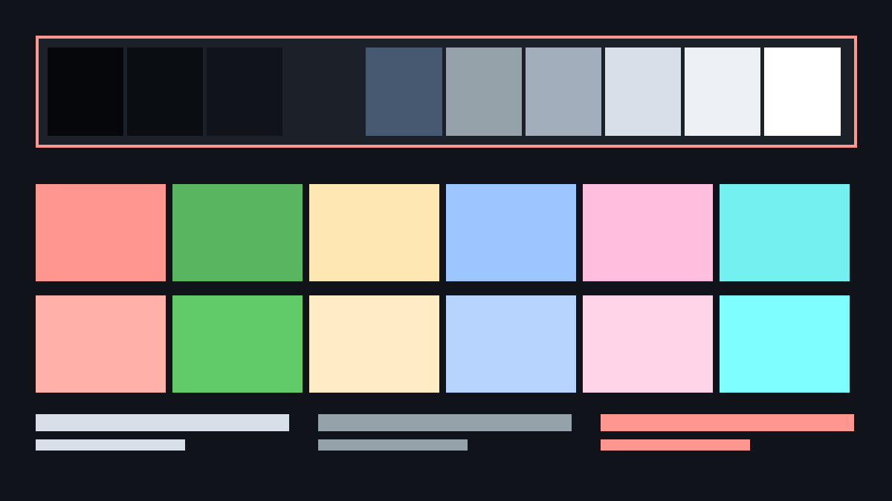

# Beacon Blue-Yellow Dark

Dark theme for Omarchy 4 Quattro, designed for tritanopia. Blue is separated from green and yellow from magenta; the red-green axis is left intact.

Part of the [Beacon theme family](https://github.com/YOURNAME/omarchy-beacon-theme-family), which explains the design method,
ships the verification tooling, and contains the other five variants.



## Install

```bash
omarchy theme install YOURNAME/omarchy-beacon-blueyellow-dark-theme
omarchy theme set beacon-blueyellow-dark
```

## Who this is for

Blue and green, or yellow and pink, are hard for you to tell apart. This is rare, around 0.01% of people, and unlike red-green deficiency it is not sex-linked.

Not sure? The family README has a short decision guide. Short version: if you
have never had trouble telling colours apart, use plain **Beacon Dark**.

## Verified numbers

Background `#10141A`, mode `dark`.

| Role | Hex | Contrast vs background | APCA Lc |
|---|---|---|---|
| foreground | `#D8DFE8` | 13.76:1 | -86 |
| bright_foreground | `#FFFFFF` | 18.47:1 | -107 |
| dark_foreground | `#A3AEBD` | 8.22:1 | -57 |
| muted / comments / color8 | `#95A2A9` | 7.05:1 | -50 |
| accent | `#FF968F` | 8.80:1 | -61 |
| orange (not an ANSI slot) | `#FFB37E` | 10.56:1 | -70 |

| ANSI | Hex | Contrast vs background |
|---|---|---|
| red | `#FF968F` | 8.80:1 |
| green | `#59B55F` | 7.21:1 |
| yellow | `#FFE7B4` | 15.25:1 |
| blue | `#9DC5FF` | 10.43:1 |
| magenta | `#FFBEDE` | 12.02:1 |
| cyan | `#75F0F0` | 13.61:1 |

- **Lowest contrast of any colour in the palette: 7.05:1.** The WCAG AAA
  threshold for body text is 7:1. Nothing here is below it, including comment
  text and the bright ANSI colours.
- Selected text on the selection band: 7.15:1
- Active window border against the desktop: 8.80:1 (WCAG 1.4.11 asks 3:1)
- Inactive window border against the desktop: 3.50:1

Reproduce all of it with `tools/verify.py` in the family repo.

## Colour vision simulation

Perceptual separation between the six chromatic slots, under the Machado,
Oliveira and Fernandes (2009) matrices at full severity. The number is the
Oklab distance of the closest pair, so higher is better and the pair named is
the palette's weakest link under that vision type.

| Vision | Closest pair | Distance |
|---|---|---|
| normal | red / magenta | 0.118 |
| protan | blue / magenta | 0.052 |
| deutan | magenta / cyan | 0.028 |
| tritan **(tuned for this)** | yellow / magenta | 0.079 |

`cvd-proof.png` in this repo shows the palette rendered four times: normal
vision plus all three simulations. Note that it collapses under protanopia and deuteranopia by design. That is the trade being made, not a defect.

## What is different about this variant

Blue is pulled away from green, and yellow away from magenta, since those are
the pairs that collapse on the tritan axis.

Red and green are **not** separated here, because they do not need to be.
Tritanopia leaves the red-green axis intact, so this palette spends its
lightness budget on the blue-yellow problem instead.

That has a consequence worth stating plainly: **this theme is not a
general-purpose colourblind theme.** If you have red-green deficiency, this
palette will be actively worse for you than the default. Use the red-green
variant instead.

## VS Code

Omarchy normally themes VS Code from a generic template, which assumes a palette
shaped like the stock themes and leaves parts of the interface unreadable with
this one. This theme ships its own `vscode-theme.json` instead. Omarchy applies
it automatically as the theme called "Omarchy" whenever this theme is active.

**After switching to this theme, reload VS Code once:** open the command
palette and run **Developer: Reload Window**, or restart VS Code. Omarchy gives
every theme without a marketplace theme the same VS Code name, "Omarchy", and
only swaps the colour file behind it. VS Code's theme setting therefore does
not change, so VS Code keeps the colours it already loaded until the window
reloads. The same happens with any Omarchy theme installed from git. Switching
to a stock theme such as Osaka Jade updates live, because its VS Code theme
has a different name.

- 71 text and indicator pairs checked. Every piece of resting text,
  including syntax colours, comments, line numbers and side bar labels, is at
  least **7.05:1**.
- Borders, focus rings, the cursor and gutter markers are at least
  **3.30:1** (WCAG 1.4.11 asks 3:1).
- **Highlighted text drops to AA.** Selection, find matches and diff
  highlights have to move toward the text colour to be visible at all. Each is
  solved so every syntax colour still reads at **4.65:1** or better on top
  of it, which leaves the highlight itself at about 1.5:1 against the
  editor. This is the same trade-off as the selection band, applied to more
  kinds of highlight.
- Faded "unused" code keeps full opacity and gets a dotted underline instead,
  because fading drops it below AAA.

The full table is in `CONTRAST-REPORT.md` in the family repo.

## What ships here

| File | Purpose |
|---|---|
| `colors.toml` | The palette. Omarchy generates every app config from this. |
| `shell.controls.toml` | Focus rings at 3px, all border alphas pinned to 1.0. |
| `shell.notifications.toml` | 6px left edge as a non-colour urgency cue. |
| `shell.menu.toml` | Selected rows marked by an edge, not only a fill. |
| `shell.lock.toml` | Lock screen text and placeholder contrast. |
| `preview.png` | Theme-switcher preview, 1200x675. |
| `cvd-proof.png` | Simulation proof sheet. |
| `vscode-theme.json` | VS Code, VSCodium and Cursor theme, generated and verified with the palette. |
| `backgrounds/` | Wallpapers with a clear centre, plus a prompt for adding more. |

The `shell.*.toml` files are **section overrides**, not a replacement
`shell.toml`. Omarchy generates the full file from its own template and each of
these replaces one section. Shipping a whole hand-written `shell.toml` would
silently miss any key a future Omarchy release adds.

Border alphas are pinned to `1.0`. Translucency quietly eats the 3:1 that WCAG
1.4.11 requires of a control boundary, and a focus ring at 60% alpha is not a
focus ring that meets 2.4.13.

## Two things this theme cannot set for you

A theme installed from a git URL has its `hyprland.lua` stripped before staging,
so these have to live in `~/.config/hypr/hyprland.conf`:

```
general    { border_size = 3 }     # focus visibility, WCAG 2.4.13
animations { enabled = false }     # reduced motion, WCAG 2.3.3
```

## Scope

This theme improves things for people with low vision and colour vision
deficiency. It does **not** make Omarchy usable with a screen reader. That is a
compositor and toolkit problem, not a palette problem. See the family README.

## Licence

MIT, to match Omarchy.
