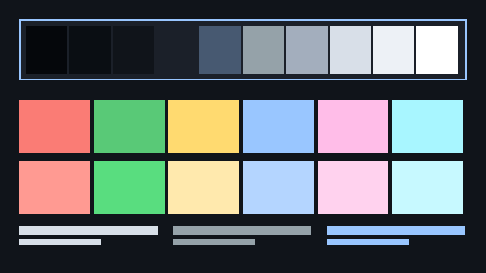

# Beacon Dark

High-contrast dark theme for Omarchy 4 Quattro. Every colour verified at WCAG AAA 7:1, including comment text and all sixteen ANSI slots.

Part of the [Beacon theme family](https://github.com/YOURNAME/omarchy-beacon-theme-family), which explains the design method,
ships the verification tooling, and contains the other five variants.



## Install

```bash
omarchy theme install YOURNAME/omarchy-beacon-dark-theme
omarchy theme set beacon-dark
```

## Who this is for

You want a dark theme that is genuinely readable and you do not have a colour vision deficiency.

Not sure? The family README has a short decision guide. Short version: if you
have never had trouble telling colours apart, use plain **Beacon Dark**.

## Verified numbers

Background `#10141A`, mode `dark`.

| Role | Hex | Contrast vs background | APCA Lc |
|---|---|---|---|
| foreground | `#D8DFE8` | 13.76:1 | -86 |
| bright_foreground | `#FFFFFF` | 18.47:1 | -107 |
| dark_foreground | `#A3AEBD` | 8.22:1 | -57 |
| muted / comments / color8 | `#95A2A9` | 7.05:1 | -50 |
| accent | `#99C6FF` | 10.45:1 | -70 |

| ANSI | Hex | Contrast vs background |
|---|---|---|
| red | `#FA7C75` | 7.22:1 |
| green | `#59C977` | 8.84:1 |
| yellow | `#FFDA70` | 13.65:1 |
| blue | `#99C6FF` | 10.45:1 |
| magenta | `#FFBDE8` | 12.05:1 |
| cyan | `#A8F6FF` | 15.21:1 |

- **Lowest contrast of any colour in the palette: 7.05:1.** The WCAG AAA
  threshold for body text is 7:1. Nothing here is below it, including comment
  text and the bright ANSI colours.
- Selected text on the selection band: 7.15:1
- Active window border against the desktop: 10.45:1 (WCAG 1.4.11 asks 3:1)
- Inactive window border against the desktop: 3.50:1

Reproduce all of it with `tools/verify.py` in the family repo.

## Colour vision simulation

Perceptual separation between the six chromatic slots, under the Machado,
Oliveira and Fernandes (2009) matrices at full severity. The number is the
Oklab distance of the closest pair, so higher is better and the pair named is
the palette's weakest link under that vision type.

| Vision | Closest pair | Distance |
|---|---|---|
| normal **(tuned for this)** | blue / cyan | 0.132 |
| protan | blue / magenta | 0.037 |
| deutan | red / green | 0.013 |
| tritan | yellow / magenta | 0.040 |

`cvd-proof.png` in this repo shows the palette rendered four times: normal
vision plus all three simulations. Under deuteranopia red and green converge here. That is expected, and it is what the red-green variant exists to fix.


## What ships here

| File | Purpose |
|---|---|
| `colors.toml` | The palette. Omarchy generates every app config from this. |
| `shell.controls.toml` | Focus rings at 3px, all border alphas pinned to 1.0. |
| `shell.notifications.toml` | 6px left edge as a non-colour urgency cue. |
| `shell.menu.toml` | Selected rows marked by an edge, not only a fill. |
| `shell.lock.toml` | Lock screen text and placeholder contrast. |
| `preview.png` | Theme-switcher preview, 1200x675. |
| `cvd-proof.png` | Simulation proof sheet. |
| `backgrounds/` | Wallpapers with a clear centre, plus a prompt for adding more. |

The `shell.*.toml` files are **section overrides**, not a replacement
`shell.toml`. Omarchy generates the full file from its own template and each of
these replaces one section. Shipping a whole hand-written `shell.toml` would
silently miss any key a future Omarchy release adds.

Border alphas are pinned to `1.0`. Translucency quietly eats the 3:1 that WCAG
1.4.11 requires of a control boundary, and a focus ring at 60% alpha is not a
focus ring that meets 2.4.13.

## Two things this theme cannot set for you

A theme installed from a git URL has its `hyprland.lua` stripped before staging,
so these have to live in `~/.config/hypr/hyprland.conf`:

```
general    { border_size = 3 }     # focus visibility, WCAG 2.4.13
animations { enabled = false }     # reduced motion, WCAG 2.3.3
```

## Scope

This theme improves things for people with low vision and colour vision
deficiency. It does **not** make Omarchy usable with a screen reader. That is a
compositor and toolkit problem, not a palette problem. See the family README.

## Licence

MIT, to match Omarchy.
