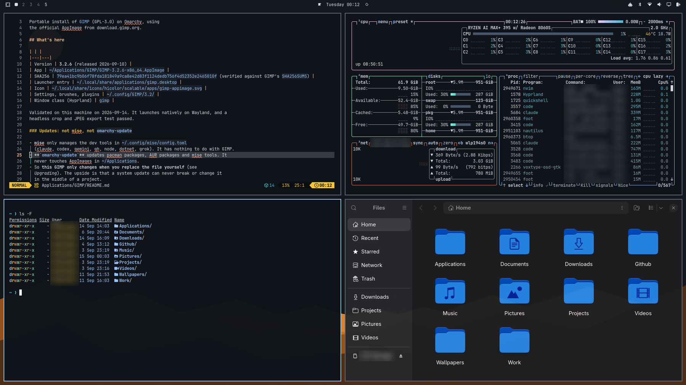
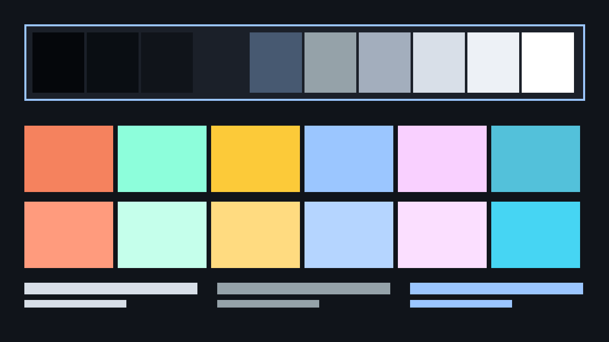

# Beacon Red-Green Dark

Dark theme for Omarchy 4 Quattro, designed for protanopia and deuteranopia. Red shifts to vermilion and green to bluish-green, then the two are pulled apart on the lightness axis.

Part of the [Beacon theme family](https://github.com/AlanRoman117/omarchy-beacon-theme-family), which explains the design method,
ships the verification tooling, and contains the other five variants.



## Install

```bash
omarchy theme install https://github.com/AlanRoman117/omarchy-beacon-redgreen-dark-theme.git
omarchy theme set beacon-redgreen-dark
```

## Who this is for

Red and green are hard for you to tell apart. This is the most common form of colour vision deficiency by a wide margin.

Not sure? The family README has a short decision guide. Short version: if you
have never had trouble telling colours apart, use plain **Beacon Dark**.

## Verified numbers

Background `#10141A`, mode `dark`.

| Role | Hex | Contrast vs background | APCA Lc |
|---|---|---|---|
| foreground | `#D8DFE8` | 13.76:1 | -86 |
| bright_foreground | `#FFFFFF` | 18.47:1 | -107 |
| dark_foreground | `#A3AEBD` | 8.22:1 | -57 |
| muted / comments / color8 | `#95A2A9` | 7.05:1 | -50 |
| accent | `#9BC6FF` | 10.48:1 | -70 |
| orange (not an ANSI slot) | `#FFC798` | 12.20:1 | -79 |

| ANSI | Hex | Contrast vs background |
|---|---|---|
| red | `#F5825E` | 7.24:1 |
| green | `#8DFEDB` | 15.24:1 |
| yellow | `#FCCA39` | 12.00:1 |
| blue | `#9BC6FF` | 10.48:1 |
| magenta | `#F9D0FF` | 13.63:1 |
| cyan | `#53C1DA` | 8.80:1 |

- **Lowest contrast of any colour in the palette: 7.05:1.** The WCAG AAA
  threshold for body text is 7:1. Nothing here is below it, including comment
  text and the bright ANSI colours.
- Selected text on the selection band: 7.15:1
- Active window border against the desktop: 10.48:1 (WCAG 1.4.11 asks 3:1)
- Inactive window border against the desktop: 3.50:1

Reproduce all of it with `tools/verify.py` in the family repo.

## Colour vision simulation

Perceptual separation between the six chromatic slots, under the Machado,
Oliveira and Fernandes (2009) matrices at full severity. The number is the
Oklab distance of the closest pair, so higher is better and the pair named is
the palette's weakest link under that vision type.

| Vision | Closest pair | Distance |
|---|---|---|
| normal | blue / cyan | 0.092 |
| protan **(tuned for this)** | blue / cyan | 0.054 |
| deutan **(tuned for this)** | green / magenta | 0.054 |
| tritan | blue / cyan | 0.068 |



`palette.png` shows the full palette, and `cvd-proof.png` in this repo shows it rendered four times: normal
vision plus all three simulations. Compare it against the default Beacon Dark proof sheet: under deuteranopia the default collapses red and green into the same olive, and this one does not.

## What is different about this variant

Red is a vermilion (hue 38 rather than 25) and green is a bluish-green (hue 172
rather than 150). Those two survive the protan and deutan confusion axes where
crimson and grass green do not.

More importantly, red and green are placed at opposite ends of the contrast
ladder. Lightness is the only channel a dichromat keeps, so a large lightness
gap is what actually makes a `git diff` readable, not the hue substitution on
its own.

The palette is tuned for the **protan** worst case specifically. Protanopia
comes with reduced luminance sensitivity to red, so reds appear darker than
they do to a deuteranope and can approach black. Anything that works for protan
works for deutan; the reverse is not reliably true.

## VS Code

Omarchy normally themes VS Code from a generic template, which assumes a palette
shaped like the stock themes and leaves parts of the interface unreadable with
this one. This theme ships its own `vscode-theme.json` instead. Omarchy applies
it automatically as the theme called "Omarchy" whenever this theme is active.

**After switching to this theme, reload VS Code once:** open the command
palette and run **Developer: Reload Window**, or restart VS Code. Omarchy gives
every theme without a marketplace theme the same VS Code name, "Omarchy", and
only swaps the colour file behind it. VS Code's theme setting therefore does
not change, so VS Code keeps the colours it already loaded until the window
reloads. The same happens with any Omarchy theme installed from git. Switching
to a stock theme such as Osaka Jade updates live, because its VS Code theme
has a different name.

- 71 text and indicator pairs checked. Every piece of resting text,
  including syntax colours, comments, line numbers and side bar labels, is at
  least **7.05:1**.
- Borders, focus rings, the cursor and gutter markers are at least
  **3.30:1** (WCAG 1.4.11 asks 3:1).
- **Highlighted text drops to AA.** Selection, find matches and diff
  highlights have to move toward the text colour to be visible at all. Each is
  solved so every syntax colour still reads at **4.66:1** or better on top
  of it, which leaves the highlight itself at about 1.5:1 against the
  editor. This is the same trade-off as the selection band, applied to more
  kinds of highlight.
- Faded "unused" code keeps full opacity and gets a dotted underline instead,
  because fading drops it below AAA.
- **Diffs: read the gutter, not the tint.** Inserted and removed highlights
  are equally light, so they differ by hue alone. VS Code's `+` and `-`
  markers and the solid gutter bars carry the difference instead: the bars use
  this palette's red and green, which are pulled apart in lightness.

The full table is in `CONTRAST-REPORT.md` in the family repo.

## What ships here

| File | Purpose |
|---|---|
| `colors.toml` | The palette. Omarchy generates every app config from this. |
| `shell.controls.toml` | Focus rings at 3px, a 2px edge on selected controls, all border alphas pinned to 1.0. |
| `shell.notifications.toml` | 6px left edge as a non-colour urgency cue. |
| `shell.menu.toml` | Selected rows marked by a 4px edge, not only a fill. |
| `shell.lock.toml` | Opaque password card, so lock screen text keeps its contrast over any wallpaper. |
| `icons.theme` | GTK icon colour matched to the accent (`Yaru-blue`, or `Yaru-red` on Blue-Yellow). |
| `preview.png` | Theme-switcher preview: a real desktop screenshot, 1800x1012. |
| `palette.png` | Palette swatch: neutral ramp, chromatic and bright rows. |
| `cvd-proof.png` | Simulation proof sheet. |
| `vscode-theme.json` | VS Code, VSCodium and Cursor theme, generated and verified with the palette. |
| `btop.theme` | btop: Omarchy's generated theme with its failing contrast pairs fixed. |
| `pi.json` | Pi: Omarchy's generated theme with its failing contrast pairs fixed. |
| `claude.json` | Claude Code: Omarchy's generated theme with its failing contrast pairs fixed. |
| `t3code.json` | T3 Code: Omarchy's generated theme with its failing contrast pairs fixed. |
| `hermes.yaml` | Hermes: Omarchy's generated theme with its failing contrast pairs fixed. |
| `obsidian.css` | Obsidian: Omarchy's generated theme with its failing contrast pairs fixed. |
| `backgrounds/` | Wallpapers with a clear centre, plus a prompt for adding more. |

The `shell.*.toml` files are **section overrides**, not a replacement
`shell.toml`. Omarchy generates the full file from its own template and each of
these replaces one section. Shipping a whole hand-written `shell.toml` would
silently miss any key a future Omarchy release adds.

Border alphas are pinned to `1.0`. Translucency quietly eats the 3:1 that WCAG
1.4.11 requires of a control boundary, and a focus ring at 60% alpha is not a
focus ring that meets 2.4.13.

## Two things this theme cannot set for you

A theme installed from a git URL has its `hyprland.lua` stripped before staging,
so these have to live in `~/.config/hypr/hyprland.conf`:

```
general    { border_size = 3 }     # focus visibility, WCAG 2.4.13
animations { enabled = false }     # reduced motion, WCAG 2.3.3
```

## Scope

This theme improves things for people with low vision and colour vision
deficiency. It does **not** make Omarchy usable with a screen reader. That is a
compositor and toolkit problem, not a palette problem. See the family README.

## Licence

MIT, to match Omarchy.
